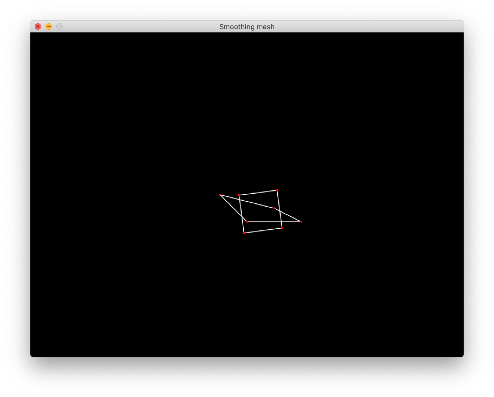
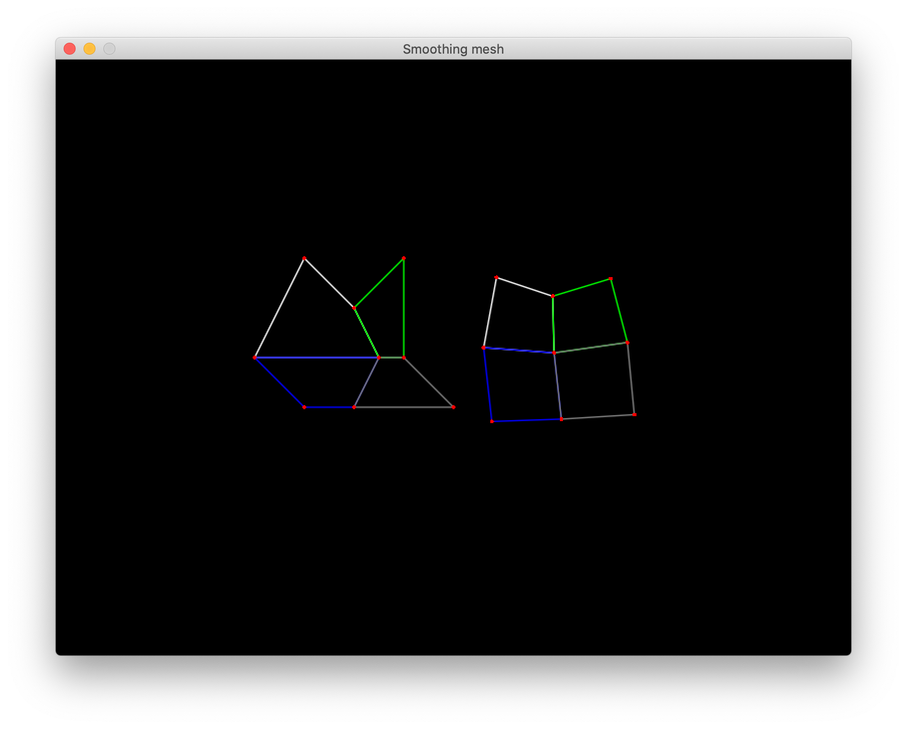

# Smoothing mesh 


Following : [Smoothing Algorithm for Planar and Surface Mesh Based on Element Geometric Deformation by 
Shuli Sun, Minglei Zhang, and Zhihong Gou](http://downloads.hindawi.com/journals/mpe/2015/435648.pdf). Thanks to them.

I have only change one thing : the formula 7 at page 4 which use the variation of quality of quad after SSO.
Negative value don't work really well with barycenter. So I use only new quality with no regard about the improvment

For only one quad 


For the whole mesh 


## Usage 

```typescript
import {Mesh} from './src/mesh'
import {Colors} from './src/color'
import {smooth} from './src/smooth'

mesh = new Mesh()
smoothedMesh = mesh

let p:Vector[] = [
	new Vector(  -1,-2),
	new Vector(  -2, 0),
	new Vector(  -1, 1),
	new Vector(   0,-1),
	new Vector( 0.5, 0),
	new Vector(   0, 1),
	new Vector(   1,-2),
	new Vector(   1, 0),
	new Vector(   2, 1),
]

mesh.insterQuad([p[0],p[1],p[4],p[3]],Colors.White)
mesh.insterQuad([p[3],p[4],p[7],p[6]],Colors.Green)
mesh.insterQuad([p[1],p[2],p[5],p[4]],Colors.Blue)
mesh.insterQuad([p[4],p[5],p[8],p[7]],Colors.Gray)


smoothedMesh = mesh
for(let i:number = 0;i<3;i++){
	let out = smooth(mesh,4,0.2,3)
	smoothedMesh = out[1]
}
```

The smooth function take 4 arguments : 

- the mesh to smooth
- the stretch factor (the higher the better)
- the shrink factor (depending on what you have put in the streck factor, to avoid scaling too much in regard of the original quad size)
- the number time you want to repeat strech and shrink 


## Demo Usage

### Setup
- `npm install`
- Have LOVE installed in path

### Running
- `npm run start`

### Packing for sending 
- `npm run pack`
